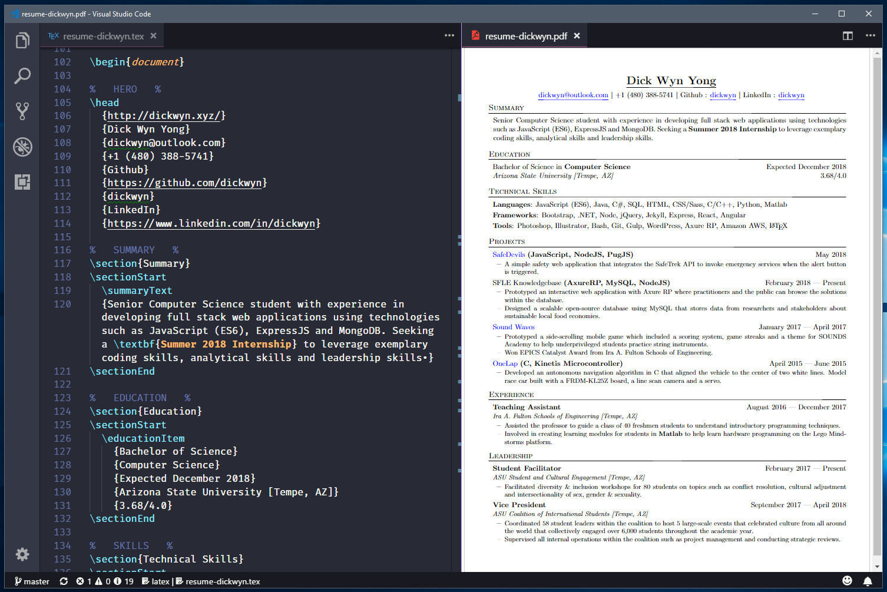

# Résumé

This LaTeX resume design is based off Sourabh Bajaj's '[Software Developer Resume](https://github.com/sb2nov/resume)'. It is also the seventh revision of my personal resume.

In my old resumes, I used Microsoft Word to format my resume. Sure, it was easy to update once I formatted the different sections correctly. But the problem arises when updating the resume for job applications which require some projects to be included and some to be dismissed. Also, Word's export to pdf is not always the quickest thing in the world.

This resume solves the problem of constantly updating my resume for job applications. I can easily comment out unecessary projects and compile the resume to be submitted. This reduces the need to keep multiple copies of the original resume as all my projects and experiences are always in the file. 

## Using this template

**About**

This resume template has been heavily optimized for my background as a Computer Science student but it can be easily adaptable to work with any major. It is also based on my resume preference. For example, the job name and degree name comes first before the company or education institution. This is the reverse of what a lot of resumes out there portray.

**Environment**

I use [Visual Studio Code](https://code.visualstudio.com/) paired up with James Yu's [LaTeX Workshop](https://github.com/James-Yu/LaTeX-Workshop) extension to compile the `.tex` into a `.pdf` file. Do note that you will also need to install a latex distribution before you can use the extension in VS Code. I am using the [TeXworks](https://github.com/TeXworks/texworks) LaTeX distrbution which requires a little configuration before it will work on VS Code. 

Here is a quick tutorial by [Matt Polnik](https://pmateusz.github.io/latex/2017/03/29/vs-code-latex-editor.html) that explains the installation process in detail. He also has instructions on adding a spell checker to check for any spelling mistakes. This is a resume after all, so having spell checking is important.

**Template**

The resume template has been structured pretty neatly and should be easily understandable if you know the basics of LaTeX. Specifically, you need to understand how commands work in LaTeX as my template is fully scripted with commands. Look at this [tutorial](https://www.sharelatex.com/learn/Commands) from ShareLaTeX. 

Here is the list of marcos (commands) that my template uses: 
1. `\head` - Takes in 9 arguments and is used to set the resume head
2. `\educationItem` - Takes in 5 arguments to specify details of past education experience
3. `\skillItem` - Takes in 2 arguments to specify a list of skills
4. `\jobHeading` - Takes in 3 arguments to specify the job name and period
4. `\projectHeading` - Takes in 4 arguments to specify the project name and period

## License

The contents of this repository are covered under the [MIT License](https://github.com/dickwyn/resume/blob/master/LICENSE)
